# GDUB Draft Bot Architecture Map

This document is the companion to `README.md`. It maps the current modular bot structure, shows which files call which layers, and follows the major execution paths from Discord interactions to services, draft logic, and SQLite persistence.

## Architecture at a Glance

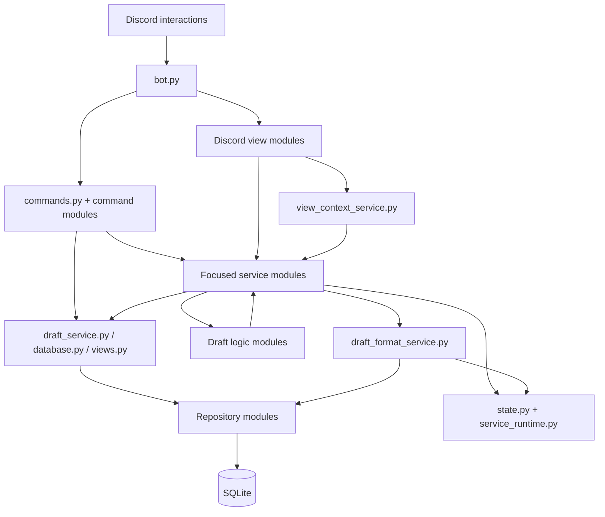

The project uses three compatibility facades—`draft_service.py`, `database.py`, and `views.py`—so older callers can keep stable imports while the actual implementation remains split into focused modules.

---

# Startup and Registration Flow

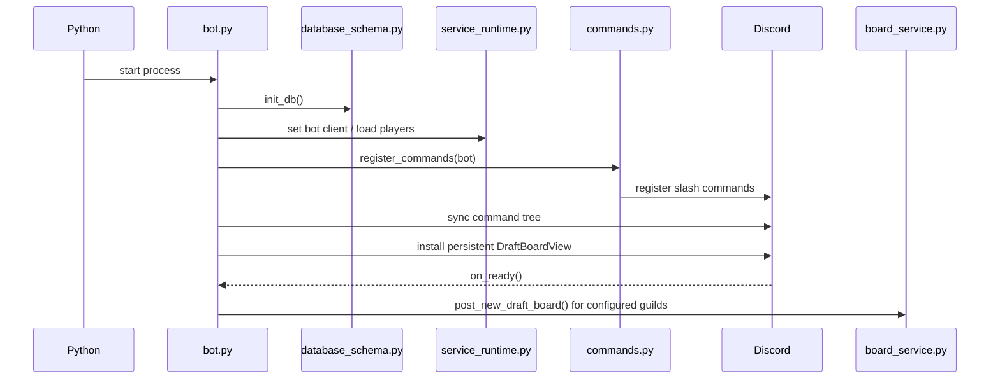

`bot.py` is intentionally small: startup, Discord events, command synchronization, persistent-view registration, and startup board posting.

---

# Command Registration Map

`commands.py` registers the focused command modules:

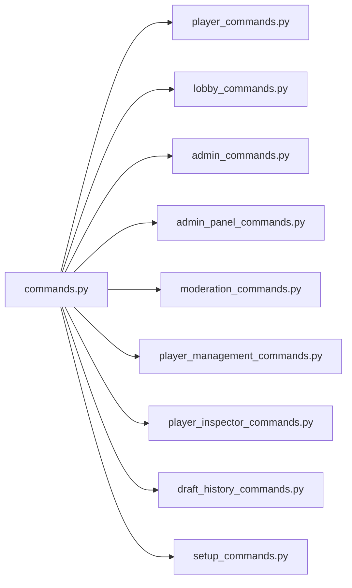

| Module | Commands |
| --- | --- |
| `player_commands.py` | `/name`, `/role`, `/stats` |
| `lobby_commands.py` | `/pickpanel`, `/resetdraft`, `/signup`, `/drop`, `/vote`, `/captain`, `/lobby`, `/draftstatus`, `/draftboard`, `/startdraft`, `/resetlobby` |
| `admin_commands.py` | `/wipelobby`, `/subnext`, `/filltest`, `/adminboard` |
| `admin_panel_commands.py` | `/admin` |
| `moderation_commands.py` | `/timeout`, `/untimeout`, `/timeouts` |
| `player_management_commands.py` | `/addplayer`, `/moveplayer`, `/queue`, `/swapplayers` |
| `player_inspector_commands.py` | `/inspectplayer` |
| `draft_history_commands.py` | `/history` |
| `setup_commands.py` | `/setup`, `/draftformat` |

---

# Draft Format Flow

The configurable format is a per-server setting from **1v1 through 8v8**, with **8v8 as the default**.

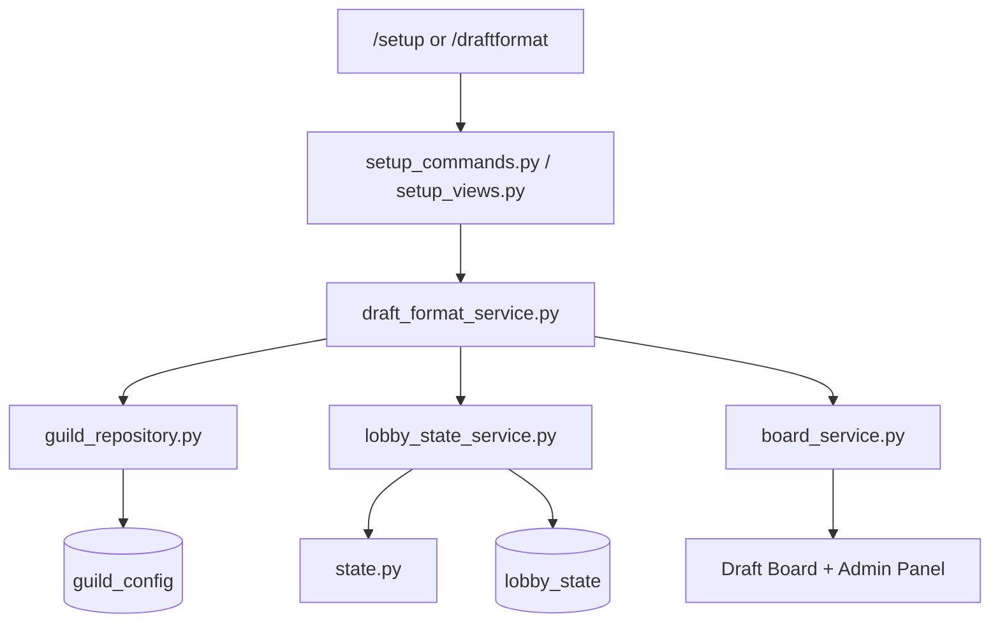

`draft_format_service.py` is the single source of truth for:

- Current team size
- Format label such as `6v6`
- Lobby capacity (`team_size * 2`)
- Validation from 1 through 8
- Automatic lobby/waiting-room rebalance after a format change
- 1v1 Captain Mode restrictions

Files that need capacity do not maintain their own independent setting; they call the format service.

---

# Signup and Waiting-Room Flow

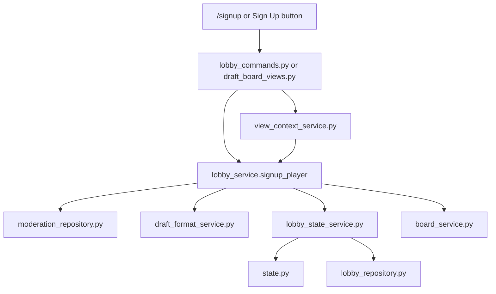

Key rules:

- The active lobby fills only to the configured format capacity.
- Existing waiting-room players keep FIFO priority over new signups.
- Dropping or kicking a lobby player can promote the next eligible waiting player.
- Format increases can promote waiting players automatically.
- Format reductions move overflow players to the front of the waiting room in their existing order.

---

# Random Draft Flow

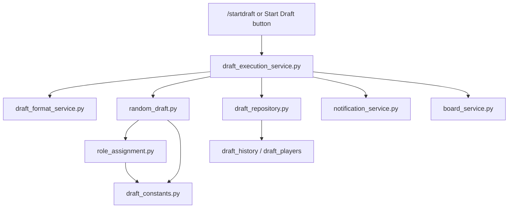

`draft_execution_service.py` validates the full lobby against the selected capacity, asks `random_draft.py` for two teams, records the result, sends notifications, and refreshes the Draft Board.

`role_assignment.py` applies the formation rules for the selected team size. 1v1 and 2v2 use flexible role-preference assignment rather than a full fixed composition.

---

# Captain Draft Flow

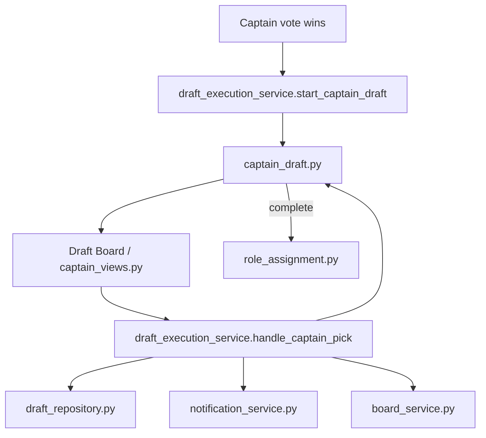

`CaptainDraft` owns the pick state:

- Captains
- Available players
- Team A / Team B
- Current pick
- Scaled pick order
- Completion based on configured team size

Captain Draft is supported from **2v2 through 8v8**. 1v1 uses the head-to-head Random Draft path.

---

# Unified Admin Panel Flow

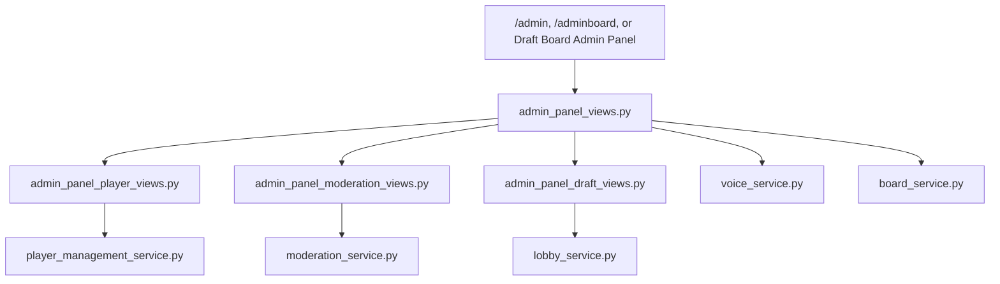

The three Admin Panel entry points converge on the same `AdminPanelView`. Start Draft remains on the normal Draft Board flow.

---

# Player Identity, Aliases, and Stats

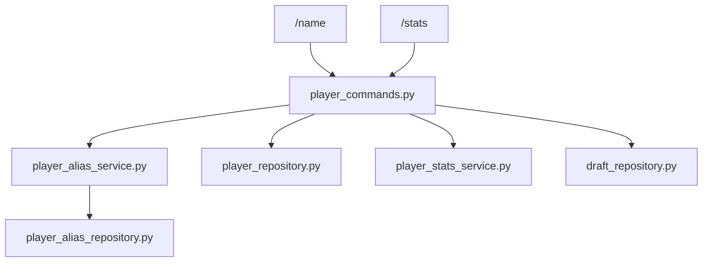

Discord user ID is the persistent player identity. Changing `/name` updates the current IGN and preserves the previous IGN through the alias service/repository.

---

# Player Inspector Flow

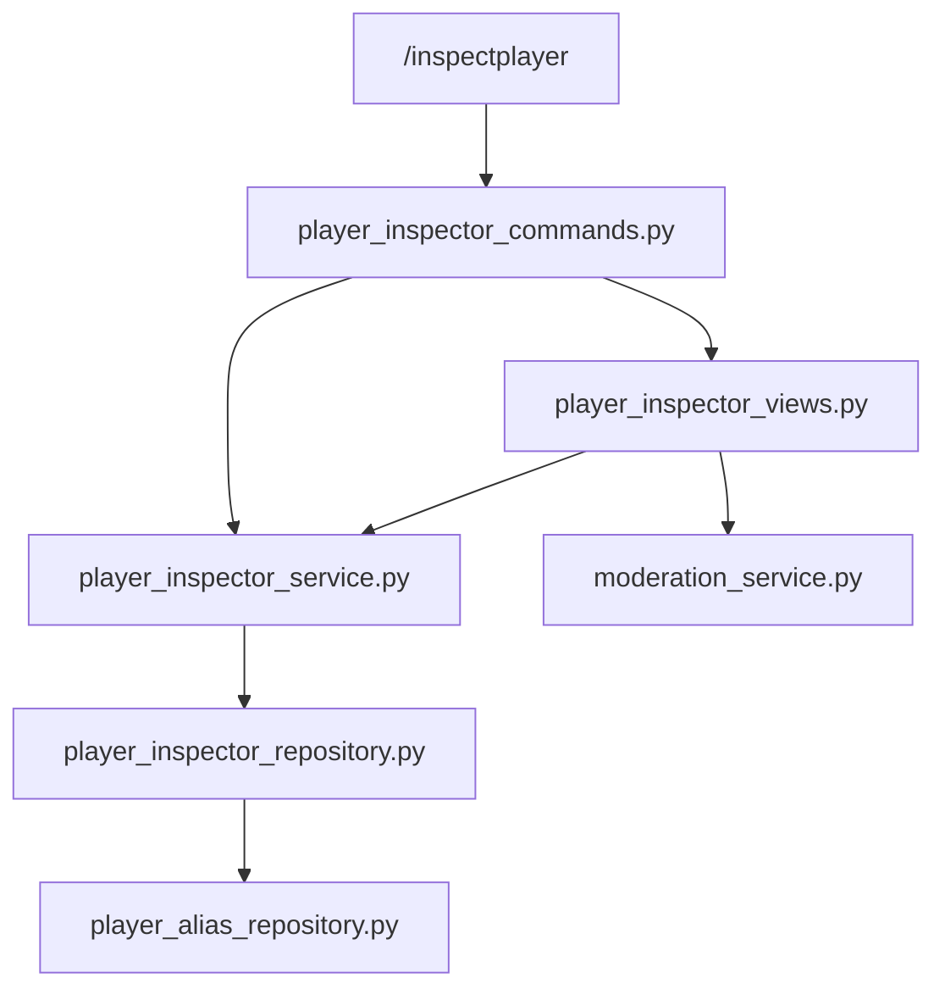

The inspector command resolves the player, builds a snapshot, and renders it through `PlayerInspectorView`. The view also exposes timeout controls through the normal moderation service.

---

# Draft History Flow

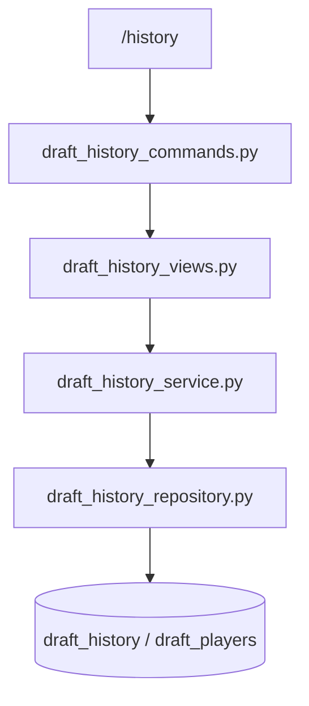

The repository reads paged history/details, the service converts rows into presentation data/embeds, and the view owns selection, pagination, detail navigation, and back navigation.

---

# Moderation Flow

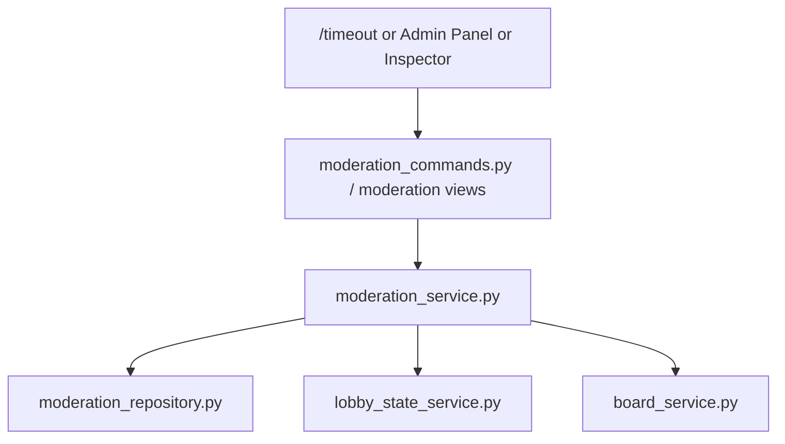

Applying a lobby timeout removes the player from active signup state, clears related draft participation state, refills the lobby when appropriate, persists the result, and refreshes the board.

---

# Voice Movement Flow

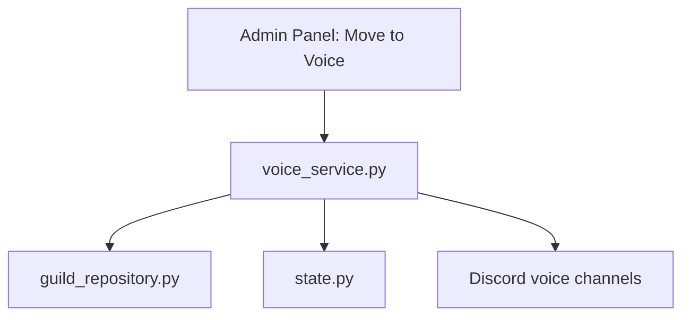

The voice service reads the configured Team A / Team B channels, chooses the current completed teams, moves connected members, and reports anyone it could not move.

---

# Persistence Map

The public persistence path is:

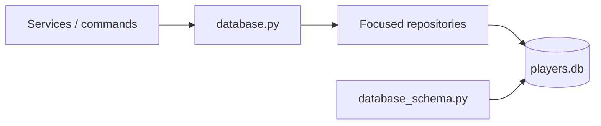

Major persisted data includes:

- `players`
- `player_aliases`
- `guild_config` including `team_size`
- `lobby_state`
- `guild_runtime_state`
- `draft_history` including the format used
- `draft_players`
- `lobby_bans`
- `player_dm_cooldown`

---

# File-by-File Map

The **Called by** and **Calls into** columns below are module-level dependency relationships from the current modular source. Runtime callbacks can add additional control flow, but this table shows where each file sits structurally.


## Entry, Configuration, and Runtime

| File | What it does | Called by | Calls into |
| --- | --- | --- | --- |
| `bot.py` | Application entry point. Creates the Discord client, initializes persistence, registers commands, installs the persistent Draft Board view, syncs commands, and reposts boards after startup. | — | `commands.py`, `config.py`, `database.py`, `draft_service.py`, `views.py` |
| `commands.py` | Top-level slash-command registry. Calls every focused command registration module. | `bot.py` | `admin_commands.py`, `admin_panel_commands.py`, `draft_history_commands.py`, `lobby_commands.py`, `moderation_commands.py`, `player_commands.py`, `player_inspector_commands.py`, `player_management_commands.py`, `setup_commands.py` |
| `config.py` | Environment/config constants plus the current role list and legacy role-name normalization. | `admin_commands.py`, `board_service.py`, `bot.py`, `captain_draft.py`, `captain_views.py`, `database.py`, `database_schema.py`, `dm_cooldown_repository.py`, `draft_history_repository.py`, `draft_logic.py`, `draft_repository.py`, `guild_repository.py`, `lobby_repository.py`, `moderation_repository.py`, `player_alias_repository.py`, `player_commands.py`, `player_inspector_repository.py`, `player_inspector_service.py`, `player_repository.py`, `player_stats_service.py`, `random_draft.py`, `role_assignment.py`, `role_needs.py` | — |
| `state.py` | In-memory per-guild runtime state: lobby, waiting room, votes, captain volunteers, draft result, teams, and related transient state. | `admin_commands.py`, `admin_panel_player_views.py`, `admin_panel_views.py`, `admin_player_helpers.py`, `board_service.py`, `draft_execution_service.py`, `draft_format_service.py`, `lobby_commands.py`, `lobby_service.py`, `lobby_state_service.py`, `moderation_commands.py`, `moderation_service.py`, `player_management_commands.py`, `player_management_service.py`, `view_context_service.py`, `voice_service.py` | — |
| `service_runtime.py` | Shared runtime references, including the Discord client and the loaded player cache. | `board_service.py`, `draft_execution_service.py`, `draft_service.py`, `lobby_service.py`, `lobby_state_service.py`, `moderation_service.py`, `notification_service.py`, `player_management_service.py`, `view_context_service.py`, `voice_service.py` | `database.py` |

## Compatibility Facades

| File | What it does | Called by | Calls into |
| --- | --- | --- | --- |
| `draft_service.py` | Compatibility facade that gives older callers one stable service import while implementations live in focused service modules. | `admin_commands.py`, `admin_panel_commands.py`, `admin_panel_draft_views.py`, `admin_panel_moderation_views.py`, `admin_panel_player_views.py`, `admin_panel_views.py`, `admin_player_helpers.py`, `bot.py`, `lobby_commands.py`, `moderation_commands.py`, `player_commands.py`, `player_inspector_commands.py`, `player_management_commands.py`, `setup_commands.py` | `board_service.py`, `draft_execution_service.py`, `lobby_service.py`, `lobby_state_service.py`, `moderation_service.py`, `notification_service.py`, `service_runtime.py`, `view_context_service.py`, `voice_service.py` |
| `database.py` | Compatibility facade that re-exports the public persistence/repository operations used throughout the bot. | `admin_commands.py`, `admin_panel_moderation_views.py`, `admin_panel_views.py`, `board_service.py`, `bot.py`, `draft_execution_service.py`, `draft_format_service.py`, `lobby_service.py`, `lobby_state_service.py`, `moderation_commands.py`, `moderation_service.py`, `notification_service.py`, `player_commands.py`, `service_runtime.py`, `view_context_service.py`, `voice_service.py` | `config.py`, `database_schema.py`, `dm_cooldown_repository.py`, `draft_repository.py`, `guild_repository.py`, `lobby_repository.py`, `moderation_repository.py`, `player_repository.py` |
| `views.py` | Compatibility facade that re-exports the core Discord UI views used by existing callers. | `admin_panel_moderation_views.py`, `board_service.py`, `bot.py`, `lobby_commands.py`, `moderation_commands.py`, `setup_commands.py` | `admin_views.py`, `captain_views.py`, `draft_board_views.py`, `setup_views.py` |

## Command Modules

| File | What it does | Called by | Calls into |
| --- | --- | --- | --- |
| `player_commands.py` | Registers `/name`, `/role`, and `/stats`; coordinates player registration, name changes/aliases, role preferences, and stats presentation. | `commands.py` | `config.py`, `database.py`, `draft_service.py`, `player_alias_service.py`, `player_stats_service.py` |
| `lobby_commands.py` | Registers lobby and draft-flow commands such as signup/drop, voting, captain volunteering, board/status commands, reset, start draft, and pick panel. | `commands.py` | `draft_service.py`, `state.py`, `views.py` |
| `admin_commands.py` | Registers focused admin utilities such as wipe, pull-next, test-lobby fill, and the legacy `/adminboard` entry point. | `commands.py` | `admin_panel_views.py`, `config.py`, `database.py`, `draft_format_service.py`, `draft_service.py`, `state.py` |
| `admin_panel_commands.py` | Registers `/admin` and opens the unified ephemeral admin control panel. | `commands.py` | `admin_panel_views.py`, `draft_service.py` |
| `moderation_commands.py` | Registers timeout-management commands and their autocomplete/list behavior. | `commands.py` | `database.py`, `draft_service.py`, `state.py`, `views.py` |
| `player_management_commands.py` | Registers manual add/move/queue/swap commands and routes them through shared player-management services. | `commands.py` | `admin_player_helpers.py`, `draft_service.py`, `player_management_service.py`, `state.py` |
| `player_inspector_commands.py` | Registers `/inspectplayer`, autocomplete, player resolution, and opening the inspector UI. | `commands.py` | `draft_service.py`, `player_inspector_service.py`, `player_inspector_views.py` |
| `draft_history_commands.py` | Registers `/history` and opens the interactive draft-history browser. | `commands.py` | `draft_history_service.py`, `draft_history_views.py` |
| `setup_commands.py` | Registers `/setup` and `/draftformat`. | `commands.py` | `draft_format_service.py`, `draft_service.py`, `views.py` |
| `admin_player_helpers.py` | Shared admin player lookup and autocomplete helpers for registered, signed, lobby, and waiting-room players. | `player_management_commands.py` | `draft_service.py`, `state.py` |

## Discord Views

| File | What it does | Called by | Calls into |
| --- | --- | --- | --- |
| `draft_board_views.py` | Persistent Draft Board buttons: signup, drop, voting, captain volunteering, Start Draft, Captain picks, Admin Panel, and status. | `views.py` | `admin_panel_views.py`, `captain_views.py`, `draft_format_service.py` |
| `captain_views.py` | Captain-pick select menu and view used while a Captain Draft is active. | `draft_board_views.py`, `views.py` | `config.py` |
| `admin_views.py` | Reusable moderation/admin UI components still used by compatibility paths, including timeout duration selection. | `views.py` | — |
| `setup_views.py` | Interactive setup wizard for channels/roles and the final draft-format selector. | `views.py` | `draft_format_service.py` |
| `admin_panel_views.py` | Builds the unified admin summary embed and top-level control buttons. | `admin_commands.py`, `admin_panel_commands.py`, `draft_board_views.py` | `admin_panel_draft_views.py`, `admin_panel_moderation_views.py`, `admin_panel_player_views.py`, `database.py`, `draft_format_service.py`, `draft_service.py`, `state.py` |
| `admin_panel_player_views.py` | Admin-panel player-management selects/modals for add, kick, move, swap, and queue position. | `admin_panel_views.py` | `draft_service.py`, `player_management_service.py`, `state.py` |
| `admin_panel_moderation_views.py` | Admin-panel timeout controls and active-timeout display/removal. | `admin_panel_views.py` | `database.py`, `draft_service.py`, `moderation_service.py`, `views.py` |
| `admin_panel_draft_views.py` | Confirmation views for Reset Draft and Wipe Lobby. | `admin_panel_views.py` | `draft_service.py` |
| `player_inspector_views.py` | Builds the admin player-inspector embed and its refresh/activity/timeout controls. | `player_inspector_commands.py` | `player_inspector_service.py` |
| `draft_history_views.py` | Interactive history selector, pagination controls, detail view, and back navigation. | `draft_history_commands.py` | `draft_history_service.py` |

## Services

| File | What it does | Called by | Calls into |
| --- | --- | --- | --- |
| `board_service.py` | Builds, posts, refreshes, and renders the Draft Board and status embeds. | `draft_execution_service.py`, `draft_service.py`, `lobby_service.py`, `moderation_service.py`, `view_context_service.py` | `config.py`, `database.py`, `draft_format_service.py`, `draft_logic.py`, `lobby_state_service.py`, `service_runtime.py`, `state.py`, `view_context_service.py`, `views.py` |
| `lobby_service.py` | Core lobby actions: reset, kick, signup, drop, voting, captain volunteering, and wipe. | `draft_service.py`, `view_context_service.py` | `board_service.py`, `database.py`, `draft_format_service.py`, `lobby_state_service.py`, `moderation_service.py`, `service_runtime.py`, `state.py` |
| `lobby_state_service.py` | Loads/saves lobby state, promotes FIFO waiting players, and rebalances the lobby when format capacity changes. | `board_service.py`, `draft_execution_service.py`, `draft_format_service.py`, `draft_service.py`, `lobby_service.py`, `moderation_service.py`, `player_management_service.py` | `database.py`, `draft_format_service.py`, `service_runtime.py`, `state.py` |
| `draft_execution_service.py` | Coordinates Start Draft, Random Draft execution, Captain Draft startup/picks, final role optimization, history persistence, notifications, and board refreshes. | `draft_service.py`, `view_context_service.py` | `board_service.py`, `database.py`, `draft_format_service.py`, `draft_logic.py`, `lobby_state_service.py`, `notification_service.py`, `service_runtime.py`, `state.py` |
| `draft_format_service.py` | Owns per-guild team size, 1v1–8v8 validation, lobby-capacity calculation, format labels, and format-change rebalancing. | `admin_commands.py`, `admin_panel_views.py`, `board_service.py`, `draft_board_views.py`, `draft_execution_service.py`, `lobby_service.py`, `lobby_state_service.py`, `player_management_service.py`, `setup_commands.py`, `setup_views.py` | `database.py`, `guild_repository.py`, `lobby_state_service.py`, `state.py` |
| `view_context_service.py` | Builds the lightweight context object injected into persistent Discord views so views can call services without owning business logic. | `board_service.py`, `draft_service.py` | `board_service.py`, `database.py`, `draft_execution_service.py`, `lobby_service.py`, `moderation_service.py`, `service_runtime.py`, `state.py`, `voice_service.py` |
| `voice_service.py` | Moves completed Team A and Team B members into the configured voice channels and reports failures. | `draft_service.py`, `view_context_service.py` | `database.py`, `service_runtime.py`, `state.py` |
| `notification_service.py` | Sends completed-draft DMs and applies the per-player notification cooldown. | `draft_execution_service.py`, `draft_service.py` | `database.py`, `service_runtime.py` |
| `moderation_service.py` | Draft-admin permission checks, timeout formatting/removal, and applying lobby timeouts while cleaning related lobby state. | `admin_panel_moderation_views.py`, `draft_service.py`, `lobby_service.py`, `view_context_service.py` | `board_service.py`, `database.py`, `lobby_state_service.py`, `service_runtime.py`, `state.py` |
| `player_management_service.py` | Shared business logic for admin add/move/queue/swap operations; used by both slash commands and the admin panel. | `admin_panel_player_views.py`, `player_management_commands.py` | `draft_format_service.py`, `lobby_state_service.py`, `service_runtime.py`, `state.py` |
| `player_alias_service.py` | Coordinates automatic previous-IGN tracking when a registered player changes names. | `player_commands.py` | `player_alias_repository.py` |
| `player_stats_service.py` | Converts stored draft statistics into rates, role-frequency summaries, and role-priority usage. | `player_commands.py` | `config.py` |
| `player_inspector_service.py` | Builds the admin-facing player snapshot from player identity, aliases, timeout status, draft stats, role history, and recent activity. | `player_inspector_commands.py`, `player_inspector_views.py` | `config.py`, `player_inspector_repository.py` |
| `draft_history_service.py` | Pagination and Discord embed formatting for draft-history list/detail views, including stored draft format. | `draft_history_commands.py`, `draft_history_views.py` | `draft_history_repository.py` |

## Draft Logic

| File | What it does | Called by | Calls into |
| --- | --- | --- | --- |
| `draft_logic.py` | Compatibility facade for team generation, role assignment, Captain Draft logic, role needs, and related constants. | `board_service.py`, `draft_execution_service.py` | `captain_draft.py`, `config.py`, `draft_constants.py`, `random_draft.py`, `role_assignment.py`, `role_needs.py` |
| `draft_constants.py` | Team formations by size, role display order, and role-assignment cost constants. | `draft_logic.py`, `random_draft.py`, `role_assignment.py` | — |
| `random_draft.py` | Generates candidate team splits for the configured format and selects teams using role fit and composition quality. | `draft_logic.py` | `config.py`, `draft_constants.py`, `role_assignment.py` |
| `captain_draft.py` | State machine for scalable 2v2–8v8 Captain Draft pick order, available players, teams, and completion. | `draft_logic.py` | `config.py` |
| `role_assignment.py` | Assigns players to the best available formation for the configured team size; uses flexible preference assignment for 1v1/2v2. | `draft_logic.py`, `random_draft.py` | `config.py`, `draft_constants.py` |
| `role_needs.py` | Analyzes the current lobby's role coverage and produces format-aware recruitment/need guidance. | `draft_logic.py` | `config.py` |

## Persistence

| File | What it does | Called by | Calls into |
| --- | --- | --- | --- |
| `database_schema.py` | Creates and migrates SQLite tables, including player data, aliases, guild settings, lobby state, draft history, moderation data, and notification cooldowns. | `database.py` | `config.py` |
| `player_repository.py` | SQLite persistence for player records and persistent player capability flags. | `database.py` | `config.py` |
| `guild_repository.py` | SQLite persistence for per-guild setup, board message ID, and draft-format team size. | `database.py`, `draft_format_service.py` | `config.py` |
| `lobby_repository.py` | SQLite persistence for ordered active-lobby and waiting-room state. | `database.py` | `config.py` |
| `draft_repository.py` | Writes completed drafts and per-player assignments, and reads player draft statistics. | `database.py` | `config.py` |
| `moderation_repository.py` | SQLite persistence for lobby timeouts and active-timeout cleanup/lookups. | `database.py` | `config.py` |
| `dm_cooldown_repository.py` | SQLite persistence for the per-guild/player draft-DM cooldown. | `database.py` | `config.py` |
| `player_alias_repository.py` | SQLite persistence and lookup/search for previous player IGNs. | `player_alias_service.py`, `player_inspector_repository.py` | `config.py` |
| `player_inspector_repository.py` | Read-focused queries for inspector identity, aliases, timeout status, draft stats, role history, and recent drafts. | `player_inspector_service.py` | `config.py`, `player_alias_repository.py` |
| `draft_history_repository.py` | Read-focused paged/detail queries for completed drafts and their team/player records. | `draft_history_service.py` | `config.py` |

---

# Where to Make Common Changes

| Goal | Primary files |
| --- | --- |
| Add or change a slash command | Relevant `*_commands.py`, then `commands.py` only if a new command module must be registered |
| Change Draft Board buttons | `draft_board_views.py` |
| Change Draft Board text/embed | `board_service.py` |
| Change signup/drop/voting behavior | `lobby_service.py` |
| Change waiting-room promotion/capacity handling | `lobby_state_service.py`, `draft_format_service.py` |
| Change available draft formats | `draft_format_service.py`, `draft_constants.py`, setup UI/command files |
| Change Random Draft composition logic | `random_draft.py`, `role_assignment.py`, `draft_constants.py`, `role_needs.py` |
| Change Captain pick behavior | `captain_draft.py`, `captain_views.py`, `draft_execution_service.py` |
| Change unified Admin Panel layout | `admin_panel_views.py` and the relevant `admin_panel_*_views.py` |
| Change admin player-management behavior | `player_management_service.py`; command/panel UIs should share it |
| Change timeout behavior | `moderation_service.py`, `moderation_repository.py` |
| Change player name/alias behavior | `player_commands.py`, `player_alias_service.py`, `player_alias_repository.py` |
| Change `/stats` calculations | `player_stats_service.py` and the stats data returned by persistence |
| Change Player Inspector presentation | `player_inspector_views.py` |
| Change Player Inspector data aggregation | `player_inspector_service.py`, `player_inspector_repository.py` |
| Change Draft History UI | `draft_history_views.py`, `draft_history_service.py` |
| Change Draft History queries/storage | `draft_history_repository.py`, `draft_repository.py`, `database_schema.py` |
| Change voice movement | `voice_service.py` |
| Change draft-ready DMs | `notification_service.py`, `dm_cooldown_repository.py` |
| Change SQLite schema | `database_schema.py` plus the affected repository |
| Change setup wizard | `setup_views.py`, `setup_commands.py`, `guild_repository.py` |

---

# Architectural Conventions

The project currently follows these conventions:

1. **Commands should be thin.** Command modules validate the interaction and hand work to services or views.
2. **Views own Discord UI state, not core business rules.** Shared behavior belongs in services so slash commands and buttons do not drift apart.
3. **Services own workflow behavior.** Lobby, moderation, draft execution, format handling, notifications, voice movement, and player management live in focused service files.
4. **Repositories own SQLite access.** New persistent fields should be added through `database_schema.py` and the appropriate repository.
5. **Facades preserve compatibility.** `draft_service.py`, `database.py`, and `views.py` keep older imports working while implementations remain modular.
6. **Per-guild runtime state stays in `state.py`.** Persistent data is written through repositories; transient draft state remains in memory.
7. **Draft format has one source of truth.** Team size is stored per guild and all capacity calculations derive from it.
8. **The 8v8 path remains the default.** Smaller formats branch through the same services rather than maintaining a separate bot flow.

---

# Quick Mental Model

When debugging a user action, trace it in this order:

```text
Discord command/button
        ↓
*_commands.py or *_views.py
        ↓
service module
        ↓
state.py / draft logic / repository
        ↓
board/history/DM/voice response
```

For persistent data:

```text
service
   ↓
database.py facade or focused repository
   ↓
*_repository.py
   ↓
players.db
```

For Draft Board buttons:

```text
draft_board_views.py
        ↓
view_context_service.py
        ↓
lobby_service.py / draft_execution_service.py / board_service.py
```

For format-dependent behavior:

```text
caller
   ↓
draft_format_service.py
   ↓
team_size
   ↓
lobby capacity / draft size / display format
```

That is the shortest path for finding where a behavior lives before changing code.
